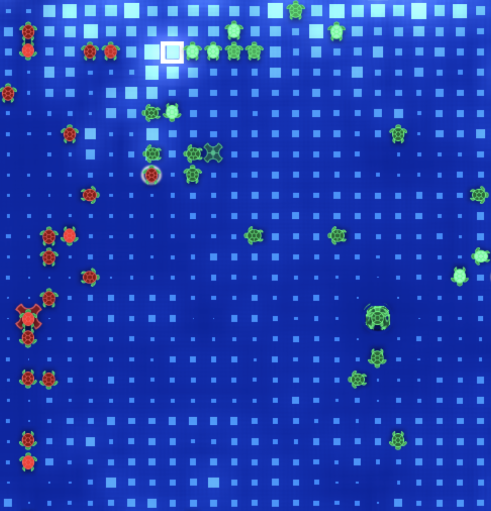

# ssantichaivekin halite bot (final rank 201)

This is a bot for the Halite 3 competition by two sigma.
Each ship greedily finds the target according to an evaluation function, which is given to be 
halite at a square divided by the sum of distance from the ship to the square and from
the square to the closest dropoff. The amount of halite a ship collects depends on the current turn
and the currnet map state. The amount of halite a ship is willing to leave behind in a square depends 
on the current turn and the current map state.

A large portion of the code is for ensuring that the ship does not collide with own's
ship and enemy's ship.

I use genetic algorithm to fine tune the parameter by making the bots play against themselves
in Digital Ocean server.
I regret doing this, as bots grow to become better at fighting among themselves and not
against the general leaderboard.

Here's a picture of the bot in action.

The code is divided into three main parts:

1. The navigator. The navigator answers where a ship should go by looking at the states of the map. 
It receives a ship assigned status and location, among other things, and assign a direction to the ship.
2. The movement map. The movement receives the directional intent of every ship and resolves them as needed.
It also takes care of not hitting enemy ships in a 4-player settings. When two ships is aiming to go to the 
same position, we raise a conflict. The job of the movement map is to resolve conflicts.
3. The main. The main glues everything together.

See the bot in action at [https://halite.io/user/?user_id=2892](https://halite.io/user/?user_id=2892)

Advice for myself next year:
1. Rewrite the starter bot to fit my needs.
2. Don't use the genetic algorithm, except when it is really called for.
Use gradient descent or simpler algorithms that are easy to reason about.
I think I would try [CLOP](https://www.remi-coulom.fr/CLOP/) next time.
3. Write or rewrite some of the visualization tools before attempting to code.
4. Think deeply about how things actually work before jumping in to coding.
Come up with a correct mathmetical model first before optimizing or linearizing for performance.
5. Keep track of the time different function/calculation the my bot uses before reasoning about performance.
Use a profiler.
